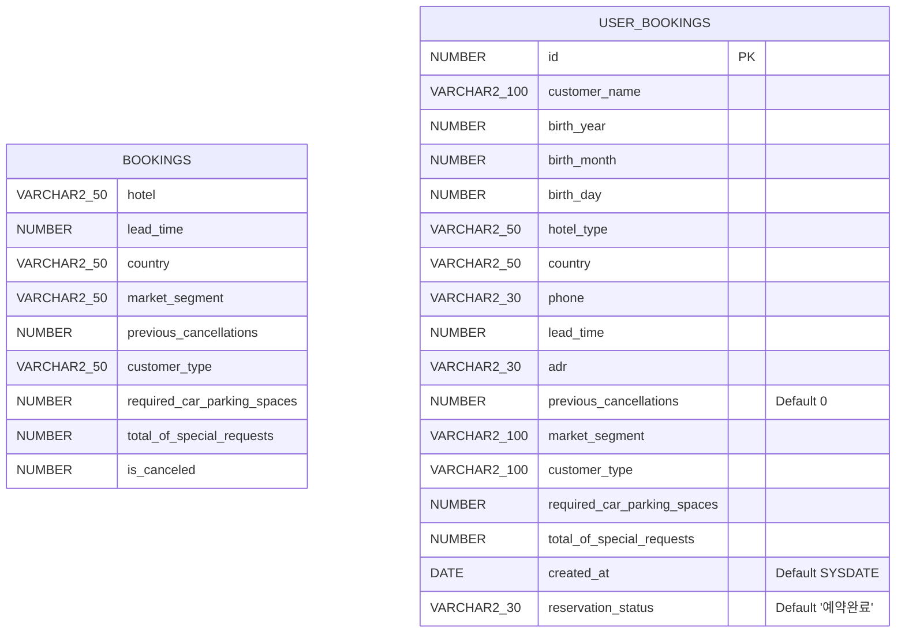

```markdown
# 📊 데이터베이스 설계 (ERD)

호텔 예약 취소 예측 프로젝트(`01_Hotel_Cancellation_Prediction_Flask`)에 사용되는 Oracle 데이터베이스 모델링 구조입니다. 
머신러닝 학습용 원본 데이터 테이블과 웹 서비스에서 실제 사용자가 입력하는 예약 정보를 관리하는 테이블로 분리되어 있습니다.

---

## 1. ERD 다이어그램

깃허브 환경에서 자동으로 렌더링되는 Mermaid 다이어그램입니다.



---

## 2. 테이블 상세 명세서

### ① BOOKINGS (머신러닝 학습 및 검증용 원본 데이터)

대용량 데이터셋(Kaggle/공공데이터) 기반의 모델 학습용 피처 세팅 테이블입니다.

| 컬럼명 | 데이터 타입 | 제약 조건 | 설명 |
| --- | --- | --- | --- |
| **HOTEL** | VARCHAR2(50) | - | 호텔 유형 (Resort Hotel, City Hotel 등) |
| **LEAD_TIME** | NUMBER | - | 예약 선행 기간 (예약일과 입실일 사이의 일수) |
| **COUNTRY** | VARCHAR2(50) | - | 투숙객 국적 |
| **MARKET_SEGMENT** | VARCHAR2(50) | - | 예약 경로 (Online TA, Offline TA 등) |
| **PREVIOUS_CANCELLATIONS** | NUMBER | - | 과거 취소 이력 횟수 |
| **CUSTOMER_TYPE** | VARCHAR2(50) | - | 고객 유형 (Transient, Contract 등) |
| **REQUIRED_CAR_PARKING_SPACES** | NUMBER | - | 주차 공간 요구 대수 |
| **TOTAL_OF_SPECIAL_REQUESTS** | NUMBER | - | 특별 요청 총 횟수 |
| **IS_CANCELED** | NUMBER | - | 취소 여부 (Target 변수: 0=투숙, 1=취소) |

### ② USER_BOOKINGS (웹 서비스 사용자 예약 관리)

Flask 웹 UI를 통해 들어오는 실시간 고객 데이터 및 예약 현황을 저장하는 시스템 테이블입니다.

| 컬럼명 | 데이터 타입 | 제약 조건 | 설명 |
| --- | --- | --- | --- |
| **ID** | NUMBER | **PK** | 예약 고유 번호 (시퀀스 자동 증가) |
| **CUSTOMER_NAME** | VARCHAR2(100) | - | 고객 이름 |
| **BIRTH_YEAR** | NUMBER | - | 출생 연도 |
| **BIRTH_MONTH** | NUMBER | - | 출생 월 |
| **BIRTH_DAY** | NUMBER | - | 출생 일 |
| **HOTEL_TYPE** | VARCHAR2(50) | - | 예약 호텔 종류 |
| **COUNTRY** | VARCHAR2(50) | - | 국적 |
| **PHONE** | VARCHAR2(30) | - | 전화번호 |
| **LEAD_TIME** | NUMBER | - | 예약 선행 기간 |
| **ADR** | VARCHAR2(30) | - | 일일 평균 객실 요금 (Average Daily Rate) |
| **PREVIOUS_CANCELLATIONS** | NUMBER | Default 0 | 과거 취소 이력 횟수 |
| **MARKET_SEGMENT** | VARCHAR2(100) | - | 예약 경로 |
| **CUSTOMER_TYPE** | VARCHAR2(100) | - | 고객 유형 |
| **REQUIRED_CAR_PARKING_SPACES** | NUMBER | - | 필요한 주차 공간 |
| **TOTAL_OF_SPECIAL_REQUESTS** | NUMBER | - | 특별 요청 사항 개수 |
| **CREATED_AT** | DATE | Default SYSDATE | 예약 생성 일시 |
| **RESERVATION_STATUS** | VARCHAR2(30) | Default '예약완료' | 현재 예약 상태 (예약완료 / 예약취소됨) |

---

## 3. 데이터베이스 객체 설정 (시퀀스 & 트리거)

* **시퀀스명:** `USER_BOOKINGS_SEQ`
* `USER_BOOKINGS` 테이블의 `ID` 관리를 위해 1부터 1씩 증가하도록 설정.


* **트리거명:** `USER_BOOKINGS_TRIGGER`
* 사용자가 웹에서 예약을 생성할 때(`INSERT` 수행 전), 자동으로 `USER_BOOKINGS_SEQ.NEXTVAL`을 호출하여 `ID` 기본키(PK) 값을 매핑해 줍니다.


