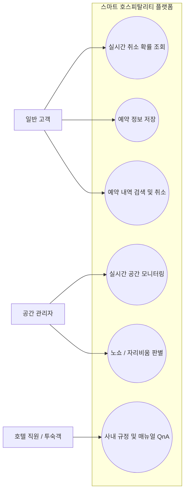

# 🗺️ 07. UML 다이어그램 명세서 (Mermaid)

## 1. Use Case Diagram (유스케이스 다이어그램)
시스템의 사용자(Actor)와 제공되는 핵심 기능(Use Case) 간의 관계를 정의합니다.

## 2. Sequence Diagram (시퀀스 다이어그램)
프론트엔드의 비동기 Fetch API 요청부터 AI 모델 추론, Oracle DB 적재까지의 동적 흐름을 명시합니다.

sequenceDiagram
    autonumber
    actor User as 일반 고객
    participant Front as 프론트엔드 (JS / Chart.js)
    participant Flask as 백엔드 (Flask 서버)
    participant Model as AI 모델 (Random Forest)
    participant DB as 데이터베이스 (Oracle 11g)

    %% 1. 실시간 예측 흐름
    User->>Front: 7가지 예약 조건 입력 및 변경
    Note over Front: 입력 이벤트 감지 (updatePrediction)
    Front->>Flask: 비동기 예측 요청 (POST /api/predict)
    Flask->>Model: 입력 데이터 주입 (Feature)
    Model-->>Flask: 취소 발생 확률 반환 (is_canceled_proba)
    Flask-->>Front: 예측 결과 응답 (JSON)
    Note over Front: 새로고침 없이 Chart.js 그래프 실시간 업데이트

    %% 2. 예약 저장 흐름
    User->>Front: [예약 저장] 버튼 클릭
    Front->>Flask: 최종 예약 및 예측 데이터 송신 (POST /api/reserve)
    Flask->>DB: RESERVATION 테이블 데이터 삽입 (INSERT)
    DB-->>Flask: 저장 완료 응답
    Flask-->>Front: 성공 메시지 응답 (status: success)
    Note over Front: 그래프 상태 고정 (Lock) 및 누적 통계 미세 갱신

## 3. Class Diagram (클래스 다이어그램)
Flask 백엔드 서버 인프라를 구성하는 컨트롤러, AI 서비스, DB 매니저 간의 정적 구조를 나타냅니다.

classDiagram
    direction BT
    
    class PredictController {
        +predict_cancellation()
        +save_reservation()
        +get_chart_data()
    }

    class ModelService {
        -model_path: String
        -model: RandomForestClassifier
        +load_model()
        +predict_proba(features: List) Float
    }

    class DatabaseManager {
        -connection_string: String
        +connect_db()
        +insert_reservation(data: Dict) Boolean
        +select_statistics() Dict
    }

    %% Relationships
    PredictController --> ModelService : AI 추론 요청
    PredictController --> DatabaseManager : DB CRUD 수행